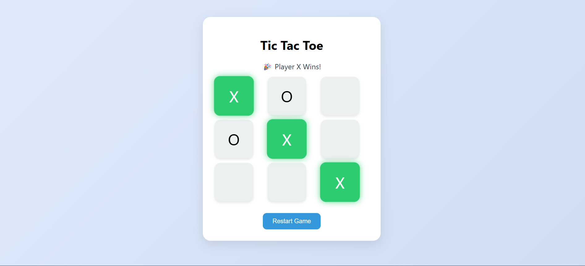

# TIC-TAC-TOE
A modern, responsive Tic-Tac-Toe game built using HTML, CSS, and vanilla JavaScript. Features include animated UI, dynamic player turns, win/draw detection, and restart functionality. Designed to offer a realistic and smooth gameplay experience across all devices.

## 📸 Demo

---

## 🚀 Features

- ✅ 3x3 interactive grid layout
- ✨ Animated cells and hover effects
- 🧠 Player turn detection and switching
- 🎉 Winning and draw message detection
- 🔁 Restart button to reset game
- 📱 Fully responsive on all screen sizes
- 🟢 Highlight winning cells with glow animation

---

## 🛠️ Built With

- **HTML5**
- **CSS3 (with animations)**
- **Vanilla JavaScript**

---

## ▶️ How to Run Locally

1. Clone the repository
2. Open the folder
3. Open `index.html` in your browser

> ✅ No dependencies or installation required. Pure front-end!

---

## 💡 Future Enhancements (Optional Ideas)

- 🔄 Undo/Redo move
- 👤 VS Computer (AI player)
- 🌓 Dark Mode toggle
- 🔊 Sound effects for click and win

---

## 🙌 Acknowledgements

Built with ❤️ for learning and fun.  
Feel free to fork, improve, and share!

